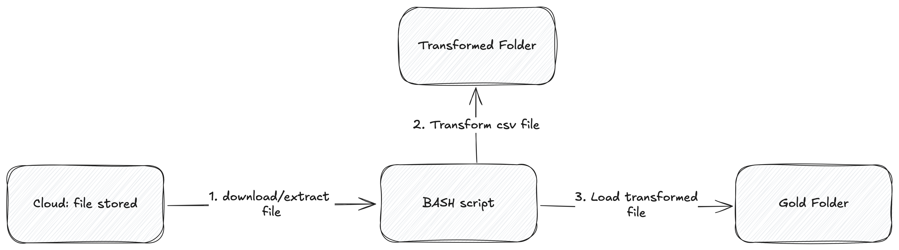

## Linux and Git Assignment
### Run the ETL
To run the application:

1. Bash ETL - Run the bash script in this parent directory (.): `./scripts/bash/etl.sh`
2. CSV to JSON: `./scripts/csv_to_json.sh`
3. CSV to Postgres:
   - For Postgres, I used Docker to run the database and Makefile for easy command execution
   - Set up the environment variables by copying `.env.example` to `.env` and adding values
   - Run `make dc_up` to run the database
   - Run the script to insert the records into the database: `./scripts/csv_to_postgres.sh`

### ETL Architecture

